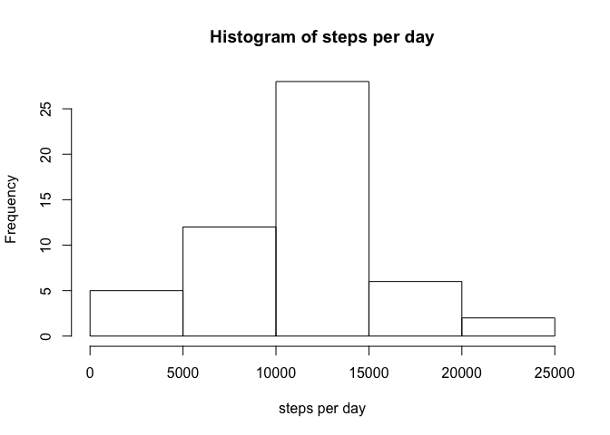
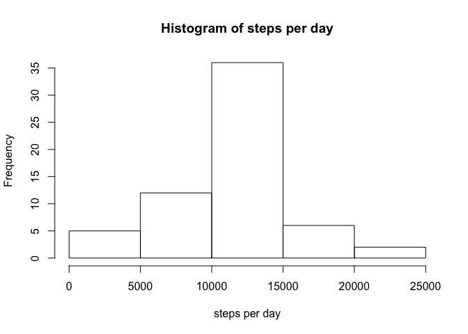

# Reproducible Research: Peer Assessment 1
niknik324  

## Loading and preprocessing the data

Getting data from activity.csv

```r
activity <- read.csv('activity.csv')
```

No need to transform.

## What is mean total number of steps taken per day?

First - split and sum data.  Days without any activity are excluded.

```r
perday <- aggregate(steps ~ date, data = activity, sum)
```


#####Now let's make our histogram.

```r
hist(perday$steps, xlab = 'steps per day', main = 'Histogram of steps per day')
```

 


#####**Mean** and **median**

```r
perdayMean <- mean(perday$steps)
perdayMedian <- median(perday$steps)
```

These are: 

**Mean:** 10766

**Median:** 10765


## What is the average daily activity pattern?
First calculate mean steps per interval

```r
meanPerInterval <- aggregate(steps ~ interval, data = activity, mean)
```

Now - plot
First calculate mean steps per interval

```r
plot(meanPerInterval, type = 'l')
```

 

Most active interval is "835"

```r
meanPerInterval[meanPerInterval$steps == max(meanPerInterval$steps),1]
```

```
## [1] 835
```


## Imputing missing values
There are `sum(is.na(activity$steps))` intevals with no infomation about steps available

```r
sum(is.na(activity$steps))
```

```
## [1] 2304
```


I will replace ol NA with mean value for that interval. And yes, I'm doing it not the easiest way.

```r
activityFIXED <- activity
for (row in 1:17568) { 
    if (is.na(activityFIXED[row,]$steps)) {
        activityFIXED[row,]$steps <- meanPerInterval[2][meanPerInterval[1]==activityFIXED[row,]$interval]
    }
}
head(activityFIXED)
```

```
##       steps       date interval
## 1 1.7169811 2012-10-01        0
## 2 0.3396226 2012-10-01        5
## 3 0.1320755 2012-10-01       10
## 4 0.1509434 2012-10-01       15
## 5 0.0754717 2012-10-01       20
## 6 2.0943396 2012-10-01       25
```

Here is my new Histogram


```r
perdayF <- aggregate(steps ~ date, data = activityFIXED, sum)
hist(perdayF$steps, xlab = 'steps per day', main = 'Histogram of steps per day')
```

 

```r
perdayMeanF <- mean(perdayF$steps)
perdayMedianF <- median(perdayF$steps)
```
**Mean:** 10766

**Median:** 1.0766189\times 10^{4}

## Are there differences in activity patterns between weekdays and weekends?
